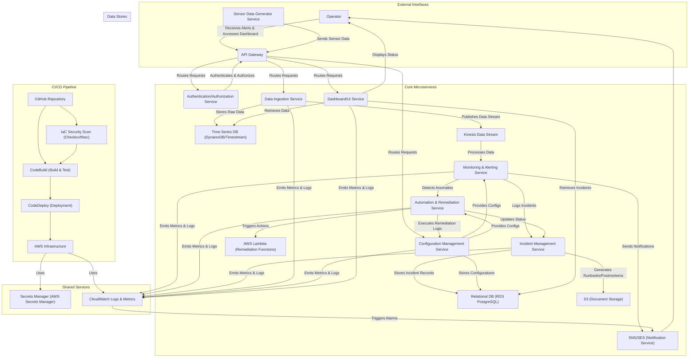

## Technical Architecture: Cloud HVAC Operations Lab

### Diagram

### Components

This architecture leverages a microservices pattern, where each core function of the HVAC operations lab is encapsulated as an independent, deployable service. This promotes scalability, resilience, and independent development.

1.  **Sensor Data Generator Service (SDG)**:
    *   **Responsibility**: Simulates HVAC sensor data (e.g., temperature, pressure). Generates data streams at configurable intervals, including normal, fault, and erratic conditions.
    *   **Data Flow**: Pushes simulated sensor readings to the API Gateway.

2.  **API Gateway (AG)**:
    *   **Responsibility**: Acts as the single entry point for all external requests, including sensor data ingestion and operator dashboard access. Handles request routing, authentication, and rate limiting.
    *   **Data Flow**: Receives data from SDG, routes to Authentication/Authorization Service, Data Ingestion Service, Configuration Management Service, and Dashboard/UI Service.

3.  **Authentication/Authorization Service (A)**:
    *   **Responsibility**: Manages user identities and access control for operators and internal services. Ensures only authorized entities can interact with the system.
    *   **Data Flow**: Authenticates requests from API Gateway and returns authorization tokens/decisions.

4.  **Data Ingestion Service (DIS)**:
    *   **Responsibility**: Receives raw sensor data from the API Gateway, performs initial validation, and publishes it to a streaming data platform for further processing. Stores raw data in a time-series database.
    *   **Data Flow**: Receives data from AG, stores in Time-Series DB, publishes to Kinesis Data Stream.

5.  **Time-Series Database (TSDB - AWS DynamoDB/Timestream)**:
    *   **Responsibility**: Stores high-volume, time-stamped sensor data efficiently for historical analysis and dashboard visualization.
    *   **Data Flow**: Receives data from DIS, queried by DMS.

6.  **Kinesis Data Stream (KDS)**:
    *   **Responsibility**: Provides a real-time, scalable data stream for processing sensor data. Decouples data producers from consumers.
    *   **Data Flow**: Receives data from DIS, consumed by MAS.

7.  **Monitoring & Alerting Service (MAS)**:
    *   **Responsibility**: Consumes sensor data from Kinesis, applies monitoring rules (thresholds, anomaly detection), detects fault conditions, and triggers alerts. Emits metrics and logs to CloudWatch.
    *   **Data Flow**: Consumes from KDS, interacts with CMS for rules, sends alerts to SNS, logs incidents to IMS, triggers AMS for remediation.

8.  **Automation & Remediation Service (AMS)**:
    *   **Responsibility**: Receives fault notifications from MAS and executes predefined automated remediation actions (e.g., restarting a simulated sensor, applying cooling logic). Utilizes AWS Lambda for executing specific remediation functions.
    *   **Data Flow**: Receives triggers from MAS, interacts with CMS for remediation logic, invokes AWS Lambda functions, updates IMS with remediation status.

9.  **Incident Management Service (IMS)**:
    *   **Responsibility**: Records all detected incidents, their status, and remediation attempts. Manages the lifecycle of incidents, including generating runbooks and post-mortems.
    *   **Data Flow**: Receives incident details from MAS and AMS, stores in Relational DB, stores documents in S3, provides data to DMS.

10. **Relational Database (RDB - AWS RDS PostgreSQL)**:
    *   **Responsibility**: Stores structured data such as incident records, configuration settings, user profiles, and runbook metadata.
    *   **Data Flow**: Receives data from IMS and CMS, queried by DMS.

11. **S3 (Document Storage)**:
    *   **Responsibility**: Stores static assets, generated runbooks, and post-mortem documents.
    *   **Data Flow**: Receives documents from IMS.

12. **Configuration Management Service (CMS)**:
    *   **Responsibility**: Centralized management of all system configurations, monitoring thresholds, and remediation logic. Ensures consistency and version control of operational parameters.
    *   **Data Flow**: Stores/retrieves configurations from RDB, provides configurations to MAS and AMS.

13. **Dashboard/UI Service (DMS)**:
    *   **Responsibility**: Provides a web-based interface for operators to visualize sensor data, system health, active incidents, and remediation status. Interacts with various services to aggregate information.
    *   **Data Flow**: Queries TSDB for sensor data, RDB for incident data, presents to Operator via API Gateway.

14. **SNS/SES (Notification Service)**:
    *   **Responsibility**: Delivers alerts and notifications to operators via various channels (email, SMS, PagerDuty integration).
    *   **Data Flow**: Receives alert messages from MAS, sends to Operator.

15. **CloudWatch Logs & Metrics (CL)**:
    *   **Responsibility**: Centralized logging and monitoring of all microservices. Collects application logs, system metrics, and provides alarming capabilities.
    *   **Data Flow**: Receives logs/metrics from all services, triggers SNS alarms.

16. **Secrets Manager (SM - AWS Secrets Manager)**:
    *   **Responsibility**: Securely stores and manages sensitive information like database credentials, API keys, and service accounts. Facilitates automatic rotation of secrets.
    *   **Data Flow**: Provides secrets to all microservices at runtime.

### Cloud Strategy

This architecture is designed for **AWS (Amazon Web Services)**, leveraging its comprehensive suite of managed services to build a scalable, resilient, and cost-effective cloud-based HVAC operations lab.

*   **Compute**: AWS Lambda for serverless microservices (e.g., Data Ingestion, Monitoring & Alerting, Automation & Remediation functions). This provides automatic scaling, high availability, and a pay-per-execution cost model, aligning with the operational nature of the project.
*   **Data Ingestion & Streaming**: AWS Kinesis Data Streams for real-time sensor data ingestion and processing, providing high throughput and low latency. AWS Kinesis Firehose could be used for batching and loading data into S3 or other data stores.
*   **Databases**: AWS DynamoDB (NoSQL) or AWS Timestream for high-volume, time-series sensor data, optimized for read/write performance. AWS RDS PostgreSQL for structured data like incident records, configurations, and user management, offering relational integrity and robust querying capabilities.
*   **API Gateway**: AWS API Gateway for managing all API endpoints, handling request routing, authentication, authorization, and throttling for both sensor data ingestion and operator dashboard access.
*   **Monitoring & Logging**: AWS CloudWatch for centralized logging, metric collection, and custom alarms. CloudWatch Logs for aggregating application and infrastructure logs. CloudWatch Alarms trigger SNS notifications.
*   **Notifications**: AWS SNS (Simple Notification Service) for sending alerts to operators via various channels (email, SMS, PagerDuty). AWS SES (Simple Email Service) for more complex email communications.
*   **Automation**: AWS Step Functions for orchestrating complex remediation workflows involving multiple Lambda functions and services. AWS Lambda for executing individual remediation scripts.
*   **Storage**: AWS S3 for cost-effective, highly durable storage of runbooks, post-mortems, and other static assets.
*   **Identity & Access Management**: AWS IAM for fine-grained access control to AWS resources, ensuring least privilege for all services and users.
*   **Containerization (Optional for some services)**: AWS ECS (Elastic Container Service) or EKS (Elastic Kubernetes Service) could be considered for services requiring more control over runtime environments or specific container orchestration features, though Lambda is preferred for simplicity and cost-efficiency in this context.
*   **Infrastructure as Code (IaC)**: AWS CloudFormation or Terraform for defining and provisioning all AWS resources, ensuring consistency, repeatability, and version control of the infrastructure.

### Security Architecture

#### Application Security
Mitigation strategies for OWASP Top 10 vulnerabilities are embedded throughout the microservices architecture:

*   **Broken Access Control**: Implemented via AWS IAM policies for service-to-service communication and AWS Cognito/IAM for user authentication/authorization, enforcing least privilege. API Gateway handles fine-grained access control for API endpoints.
*   **Cryptographic Failures**: All data in transit is encrypted using TLS 1.2+ (enforced by API Gateway, Kinesis, RDS, DynamoDB). Data at rest is encrypted using AWS KMS-managed keys for S3, RDS, DynamoDB, and Kinesis.
*   **Injection**: Input validation and sanitization are performed at the API Gateway and within each microservice (e.g., Data Ingestion Service, Configuration Management Service). Parameterized queries are used for database interactions (RDS).
*   **Insecure Design**: Threat modeling is conducted during design phases. Microservices are designed with clear boundaries and minimal attack surface. Secure defaults are enforced for all AWS services.
*   **Security Misconfiguration**: Automated IaC scanning (see IaC Security below) and regular security audits ensure AWS resources are configured securely. AWS Security Hub and Config continuously monitor for misconfigurations.
*   **Vulnerable and Outdated Components**: Dependency scanning tools (e.g., Snyk, Trivy) are integrated into the CI/CD pipeline to identify and remediate vulnerabilities in third-party libraries and container images. AWS Lambda runtimes are regularly updated.
*   **Identification and Authentication Failures**: Strong authentication mechanisms (e.g., multi-factor authentication for operators) are enforced. AWS Cognito or IAM Identity Center can be used for user identity management. Secrets are managed via AWS Secrets Manager.
*   **Software and Data Integrity Failures**: Code signing for Lambda functions and container images. Version control for all code and configurations. Data integrity checks are performed during ingestion and processing.
*   **Security Logging and Monitoring Failures**: Comprehensive logging to AWS CloudWatch Logs for all services. CloudWatch Alarms trigger on suspicious activities. AWS GuardDuty provides intelligent threat detection.
*   **Server-Side Request Forgery (SSRF)**: Network segmentation and strict egress filtering prevent services from making unauthorized requests to internal resources or metadata endpoints.

#### Advanced Security Practices

*   **Zero Trust Principles**: 
    *   **Never Trust, Always Verify**: Every request, whether internal or external, is authenticated and authorized. IAM roles and policies enforce strict access controls between microservices.
    *   **Least Privilege Access**: All services and users are granted only the minimum permissions necessary to perform their functions.
    *   **Micro-segmentation**: Network segmentation (see below) is applied at the finest possible granularity to isolate workloads.
    *   **Continuous Monitoring**: Extensive logging and monitoring (CloudWatch, GuardDuty, Security Hub) provide continuous visibility into system behavior and potential threats.
    *   **Automated Response**: Integration with AWS Security Hub and Lambda for automated remediation of detected security incidents.

*   **Network Segmentation**: 
    *   **VPC (Virtual Private Cloud)**: The entire infrastructure resides within a dedicated VPC, logically isolated from other AWS customers.
    *   **Subnets**: Workloads are deployed into public and private subnets. Public subnets host internet-facing components (e.g., API Gateway, Load Balancers). Private subnets host all backend microservices, databases, and internal resources.
    *   **Security Groups**: Act as virtual firewalls at the instance/ENI level, controlling inbound and outbound traffic for each microservice. Only necessary ports and protocols are allowed between specific services.
    *   **Network ACLs (NACLs)**: Provide an additional layer of stateless firewall protection at the subnet level, acting as a coarse-grained security control.
    *   **VPC Endpoints**: Used to securely connect to AWS services (e.g., S3, DynamoDB, Kinesis, Secrets Manager) from private subnets without traversing the public internet, enhancing data security and reducing attack surface.

#### IaC Security

Infrastructure as Code (IaC) security is a critical part of the CI/CD pipeline to ensure that infrastructure deployments are secure by design.

*   **Pre-commit Hooks**: Developers use tools like `pre-commit` to run basic IaC linting and security checks (e.g., `cfn_nag`, `terraform validate`) before committing code, catching issues early.
*   **CI/CD Pipeline Integration**: 
    *   **Static Analysis Tools**: During the `CodeBuild` phase, dedicated security scanning tools are executed against IaC templates (CloudFormation, Terraform).
        *   **Checkov**: Scans CloudFormation, Terraform, Kubernetes, and other IaC for misconfigurations and compliance violations against security best practices.
        *   **tfsec**: Specifically designed for Terraform, it identifies potential security issues and misconfigurations in Terraform code.
        *   **cfn_nag**: A static analysis tool for CloudFormation templates that checks for security vulnerabilities.
    *   **Policy Enforcement**: Custom policies are defined to enforce organizational security standards (e.g., requiring encryption for S3 buckets, disallowing public access, enforcing specific IAM role configurations).
    *   **Automated Remediation/Blocking**: If security scans detect critical vulnerabilities or policy violations, the CI/CD pipeline is configured to either fail the build (blocking deployment) or automatically suggest remediation steps.
*   **Version Control**: All IaC templates are stored in GitHub, enabling version control, audit trails, and peer review processes for security changes.
*   **Drift Detection**: AWS Config continuously monitors the deployed AWS resources for deviations from the desired state defined in IaC, alerting on any unauthorized changes.

#### Secrets Management

A robust secrets management strategy is crucial for protecting sensitive credentials and configuration data.

*   **AWS Secrets Manager**: 
    *   **Centralized Storage**: All secrets (database credentials, API keys, service account tokens) are stored securely in AWS Secrets Manager.
    *   **Automatic Rotation**: Secrets Manager is configured to automatically rotate database credentials (e.g., for RDS PostgreSQL) on a scheduled basis, reducing the risk of compromised long-lived credentials.
    *   **Fine-Grained Access Control**: IAM policies are used to grant specific microservices and Lambda functions read-only access to only the secrets they require, adhering to the principle of least privilege.
    *   **Encryption**: Secrets are encrypted at rest using AWS KMS and in transit using TLS.
*   **Runtime Injection**: 
    *   Microservices retrieve secrets at runtime using the AWS SDK, rather than hardcoding them or passing them as environment variables directly in deployment manifests.
    *   For Lambda functions, secrets can be fetched directly from Secrets Manager or securely injected as environment variables via secure deployment practices (e.g., using encrypted environment variables or fetching on invocation).
*   **No Hardcoding**: Secrets are never hardcoded in application code or IaC templates.
*   **Audit Trails**: AWS CloudTrail logs all API calls to Secrets Manager, providing an audit trail of who accessed which secret and when.
